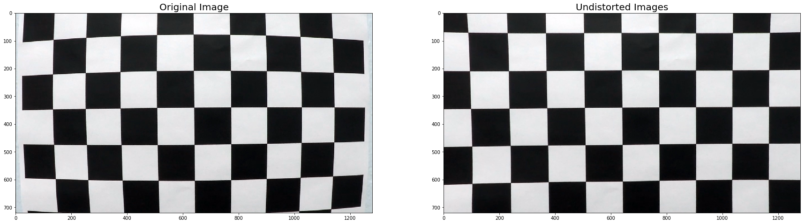
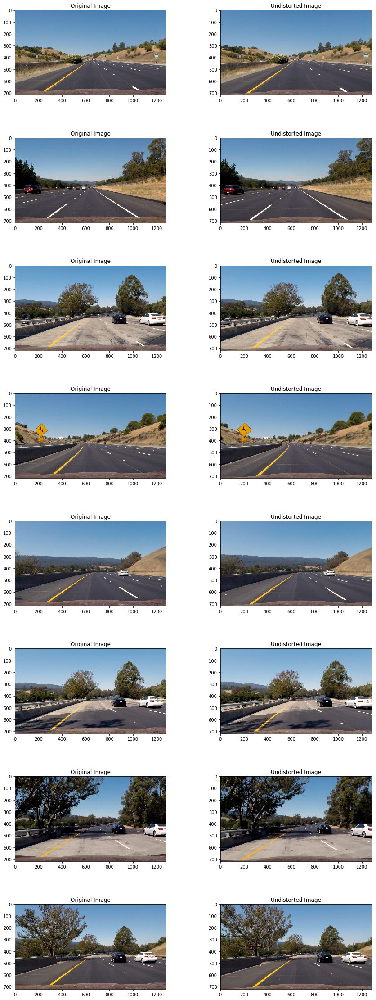
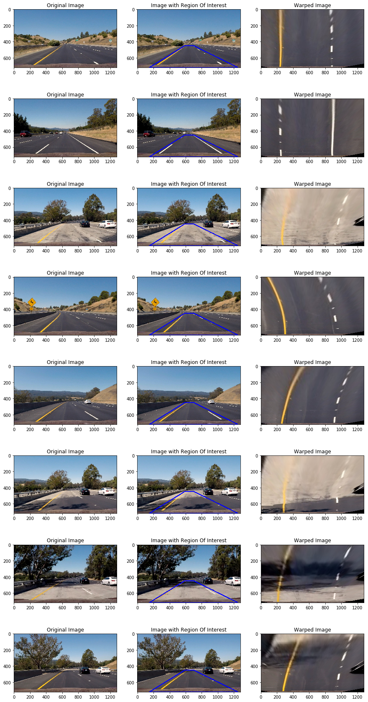
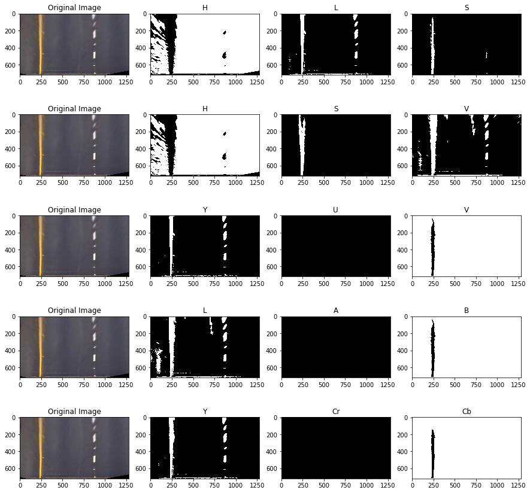
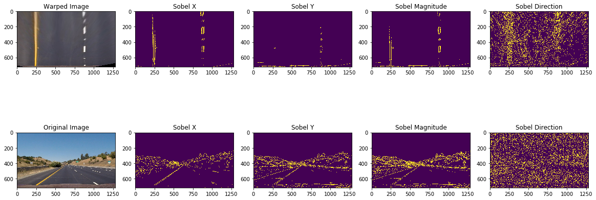
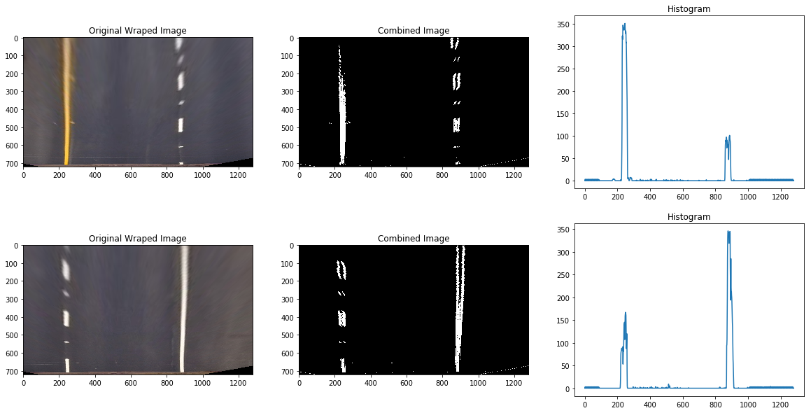
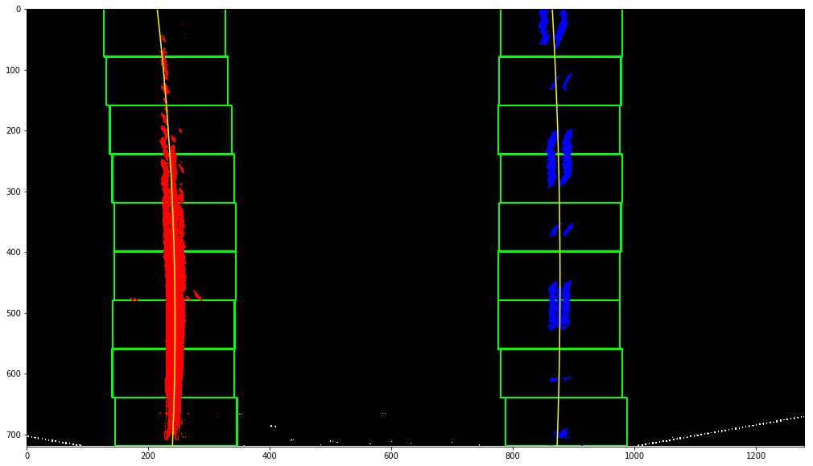
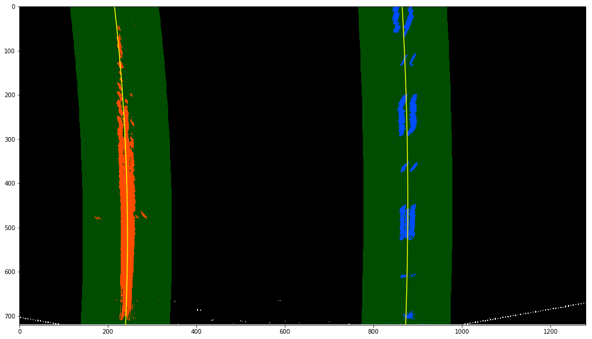
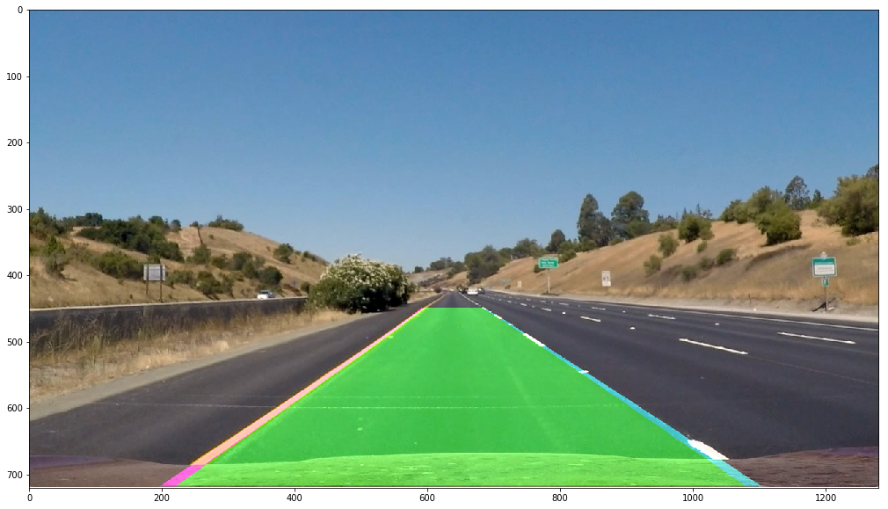
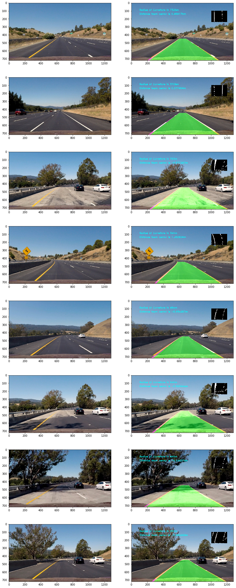

## Camera Calibration

I started by Preparing Objpoints and ImagePoints. The following steps were followed-:

1. Grayscale the image
2. Find Chessboard Corners. It returns two values ret,corners. ret stores whether the corners were returned or not
3. If the corners were found, append corners to image points.
4. I have also drawn the chessboard corners to visualize the corners

With this step we will be able to get image points and object points which will be required to calculate the camera calibration and distortion coefficients.

We call the calibrateCamera function which returns us a bunch of parameters, but the ones we are interested are the camera matrix (mtx) and distortion coefficient (dist).

We then use the distortion coefficient to undistort our image.


```python
# Step 1- Camera calibration

import numpy as np
import cv2
import matplotlib.pyplot as plt
import glob

#Creating an array for object Points
objp = np.zeros((6*9,3), np.float32)
objp[:,:2] = np.mgrid[0:9, 0:6].T.reshape(-1,2)


objpoints=[] #3D points in real space 
imgpoints=[] #2D points in img space

# Make a list of calibration images
images = glob.glob('camera_cal/calibration*.jpg')

f, axes= plt.subplots(1,2,figsize=(30,30))

for index,image in enumerate(images):
    originalImage= cv2.imread(image)
    grayImg= cv2.cvtColor(originalImage, cv2.COLOR_BGR2GRAY) #converting to Grayscale before finding Chessboard Corners

    if(index==1 ):
        # Plotting the original Image
        axes[0].set_title('Original Image', fontsize=20)
        axes[0].imshow(originalImage)

    # Find the chessboard corners
    ret, corners = cv2.findChessboardCorners(grayImg, (9,6), None)

    if(ret==True):
        objpoints.append(objp)
        imgpoints.append(corners)

        # Drawing Chessboard Corners
        cv2.drawChessboardCorners(originalImage, (9,6), corners, ret)
        if(index==1 ):
            axes[1].set_title('Image with Chessboard Corners', fontsize=20)
            axes[1].imshow(originalImage)

# from Step 1 we get the Object Points and Image Points
```


```python
# Step 2- Calculating Undistortion Parameters

img = cv2.imread('camera_cal/calibration1.jpg')
img_size = (img.shape[1], img.shape[0])


ret, mtx, dist, rvecs, tvecs = cv2.calibrateCamera(objpoints, imgpoints, img_size,None,None)

dst = cv2.undistort(img, mtx, dist, None, mtx)

f, axes= plt.subplots(1,2,figsize=(30,30))


axes[0].imshow(img)
axes[0].set_title("Original Image", fontsize=20)
axes[1].imshow(dst)
axes[1].set_title("Undistorted Images", fontsize=20)

#from Step 2 we get two important parameters- dist(the distortion coefficient), mtx(camera matrix)
```


    <matplotlib.text.Text at 0x196322b8c50>





## Pipeline (test images)

### Example of a distortion-corrected image

Using the camera matrix and distortion coefficient calculated above we can undistort our test images.


```python
# Step 3- Defining a function to undistort Images using parameters derived from previous step

def undistortImage(image):
    return cv2.undistort(image, mtx, dist, None, mtx)
```


```python

```





## Perspective Transform with Example

In this step, I first defined a Region Of Interest (ROI) i.e. a Trapezoid with four points:

1. Left Bottom Corner defined as "left"
2. Right Bottom Corner defined as "right"
3. Left Upper Corner defined as "apex_left"
4. Right Upper Corner defined as "apex_right"

After defining the ROI, the next step is to warp the image, to see the image from bird's eye perspective.
To do this we need to calculate a Matrix with the source and destination points. The destination points were selected appropriately so as to see a good bird's eye perspective. The selection of these points were based on hit an trial mechanism only.

Once we get the Matrix we will that along with Image to CV2 warpPerspective function to get the final warped image.


```python
# Step 4, 5- Defining a Region of Interest, Warping an Image from bird's eye view

left=[150,720] #left bottom most point of trapezium
right=[1250,720] #right bottom most point of trapezium
apex_left=[590,450] # left top most point of trapezium
apex_right=[700,450] # right top most point of trapezium

src=np.float32([left,apex_left,apex_right,right]) # Source Points for Image Warp
dst= np.float32([[200 ,720], [200  ,0], [980 ,0], [980 ,720]]) # Destination Points for Image Warp


def ROI(originalImage):
    return cv2.polylines(originalImage,np.int32(np.array([[left,apex_left,apex_right,right]])),True,(0,0,255),10)

def WarpPerspective(image):
    y=image.shape[0]
    x=image.shape[1]
    M = cv2.getPerspectiveTransform(src, dst)
    return cv2.warpPerspective(image, M, (x,y), flags=cv2.INTER_LINEAR)
```


```python


```





## Color Transformations with example

As per Udacity's suggestion, I tried a various number of colorspaces to get a good binary image in all lighting conditions. I tried the following color Spaces-:
1. HLS
2. HSV
3. LAB
4. YUV
5. YCrCb

I defined a common function to extract a particular channel from a colorspace.

Function Name- ExtractChannel

Input- 
* image - the warped image from which we need to extract
* colorspace- the cv2 colorspace. Ex- cv2.COLOR_RGB2HSV
* threshold- the threshold value of pixels which need to be selected in order to get the binary image. [min_threshold, max_threshold]
* channel- the channel we need to extract from the image

Output-
Binary Image with the required channel and threshold values applied


```python
# Step 6- Selecting a Color Space

def ExtractChannel(image,colorspace,threshold,channel=0):
    colorspace = cv2.cvtColor(image, colorspace)
    extracted_channel = colorspace[:,:,channel]
    binary = np.zeros_like(extracted_channel)
    binary[(extracted_channel >= threshold[0]) & (extracted_channel <= threshold[1])] = 1
    return binary
```


```python

```


    <matplotlib.text.Text at 0x1fc5933bf28>





## Sobel with example

I defined a common function to apply sobel.

Function Name- Sobel

Input- 
* warpedimage- the original warped image
* threshold- the threshold that is to be applied to select the pixel values
* sobelType- the direction where we need to take the gradient. values- x- for x gradient , y- for y gradient, xy for absolute and dir for direction
* kernelSize- the size of the kernel

Output- Binary Image with the required thresholds , sobelType and kernelSize


```python
# Step 7- Applying Sobel to warped image

def Sobel(warpedimage, threshold, sobelType, kernelSize=3):
    
    gray = cv2.cvtColor(warpedimage, cv2.COLOR_RGB2GRAY) # Step 1- Convert to GrayScale
    sobelx = cv2.Sobel(gray,cv2.CV_64F, 1, 0, ksize=kernelSize)
    sobely = cv2.Sobel(gray,cv2.CV_64F, 0, 1, ksize=kernelSize)
    
    abs_sobelx = np.absolute(sobelx)
    abs_sobely = np.absolute(sobely)
    
    grad= np.sqrt(sobelx**2 + sobely**2)
    
    arctan= np.arctan2(abs_sobely,abs_sobelx)
    
    valParam=abs_sobelx
    
    if(sobelType=='x'):
        valParam=abs_sobelx
    elif(sobelType=='y'):
        valParam= abs_sobely
    elif(sobelType=='xy'):
        valParam= grad
    else:
        valParam=arctan
        
    
    img = np.uint8((valParam* 255)/np.max(valParam)) # Creating a normalized sobel image
    binary_output = np.zeros_like(img)
    binary_output[(img > threshold[0]) & (img < threshold[1])]=1
    return binary_output
```


```python

```


    <matplotlib.text.Text at 0x1fc5844ef28>





## Combination of Color Transform and Gradients with example

The choice of selection of the color spaces were random but with a purpose. I decided to use Saturation channel of HLS because it works sort of well under all conditions. But that was not enough as it was not able to generate lines for dotted white lines. I observed that the Lightness channel HLS works well in all the conditions except the case when the image is too bright. I decided to use and of both Saturation and Lightness Channel. But I was not even happy with that as some faint edges were still not detected so I decided to use another luminance channel, this time from YUV colorspace- the Y channel.

Once I was done with selecting the color space the next step was to select the Gradient I wanted to apply. As I could see clear vertical edges using the x gradient, I decided to use X gradient only.

Final Combination-

1. Mix Channel 1 = Saturation Channel and Lightness Channel from HLS
2. Mix Channel 2 = Mix Channel 1 and Y channel for YUV
3. Final Combination= Mix Channel 2 or Sobel Gradient in X direction


```python
# Step 8- Combining Different ColorSpaces and Sobel Variants

def combineEverything(warpedImage, color_threshold, sobel_threshold):
    
    s_channel = ExtractChannel(warpedImage,cv2.COLOR_RGB2HLS,color_threshold,2)
    l_channel = ExtractChannel(warpedImage,cv2.COLOR_RGB2HLS,color_threshold,1)
    y_channel= ExtractChannel(warpedImage,cv2.COLOR_RGB2YUV,color_threshold,0)
    
    sobelx = Sobel(warpedImage, sobel_threshold, 'x')
    sobeldir= Sobel(warpedImage, [0.7,25], 'dir')
    #sobelxy=Sobel(warpedImage, sobel_threshold, 'xy')
    combined_binary = np.zeros_like(s_channel)
    combined_binary[(((s_channel == 1) & (l_channel==1)) & (y_channel==1)) | (sobelx == 1)  ] = 1
    return combined_binary
```


```python

```


## Identifying lane-line pixels with Example

The first step is to create a Histogram of lower half of the image. With this way we are able to find out a distinction between the left lane pixels and right lane pixels.


```python
# Step 9 Plotting Histogram

def Histogram(warpedimage):
    return np.sum(warpedimage[warpedimage.shape[0]//2:,:], axis=0)
```


```python

```


    <matplotlib.text.Text at 0x1fc5e0a70f0>





The next step is to initiate a Sliding Window Search in the left and right parts which we got from the histogram.

The sliding window is applied in following steps:

1. The left and right base points are calculated from the histogram
2. We then calculate the position of all non zero x and non zero y pixels.
3. We then Start iterating over the windows where we start from points calculate in point 1.
4. We then identify the non zero pixels in the window we just defined
5. We then collect all the indices in the list and decide the center of next window using these points 
6. Once we are done, we seperate the points to left and right positions
7. We then fit a second degree polynomial using np.polyfit and point calculate in step 6.


```python
# Step 10- Sliding Window Search
def SlidingWindowSearch(binary_warped, plot=False):

    histogram = Histogram(binary_warped)
    # Create an output image to draw on and  visualize the result
    out_img = np.dstack((binary_warped, binary_warped, binary_warped))*255
    # Find the peak of the left and right halves of the histogram
    # These will be the starting point for the left and right lines
    midpoint = np.int(histogram.shape[0]/2)
    leftx_base = np.argmax(histogram[:midpoint])
    rightx_base = np.argmax(histogram[midpoint:]) + midpoint

    # Choose the number of sliding windows
    nwindows = 9
    # Set height of windows
    window_height = np.int(binary_warped.shape[0]/nwindows)
    # Identify the x and y positions of all nonzero pixels in the image
    nonzero = binary_warped.nonzero()
    nonzeroy = np.array(nonzero[0])
    nonzerox = np.array(nonzero[1])
    # Current positions to be updated for each window
    leftx_current = leftx_base
    rightx_current = rightx_base
    # Set the width of the windows +/- margin
    margin = 100
    # Set minimum number of pixels found to recenter window
    minpix = 50
    # Create empty lists to receive left and right lane pixel indices
    left_lane_inds = []
    right_lane_inds = []

    # Step through the windows one by one
    for window in range(nwindows):
        # Identify window boundaries in x and y (and right and left)
        win_y_low = binary_warped.shape[0] - (window+1)*window_height
        win_y_high = binary_warped.shape[0] - window*window_height
        win_xleft_low = leftx_current - margin
        win_xleft_high = leftx_current + margin
        win_xright_low = rightx_current - margin
        win_xright_high = rightx_current + margin
        # Draw the windows on the visualization image
        if(plot==True):
            cv2.rectangle(out_img,(win_xleft_low,win_y_low),(win_xleft_high,win_y_high),(0,255,0), 2) 
            cv2.rectangle(out_img,(win_xright_low,win_y_low),(win_xright_high,win_y_high),(0,255,0), 2) 
        # Identify the nonzero pixels in x and y within the window
        good_left_inds = ((nonzeroy >= win_y_low) & (nonzeroy < win_y_high) & 
        (nonzerox >= win_xleft_low) &  (nonzerox < win_xleft_high)).nonzero()[0]
        good_right_inds = ((nonzeroy >= win_y_low) & (nonzeroy < win_y_high) & 
        (nonzerox >= win_xright_low) &  (nonzerox < win_xright_high)).nonzero()[0]
        # Append these indices to the lists
        left_lane_inds.append(good_left_inds)
        right_lane_inds.append(good_right_inds)
        # If you found > minpix pixels, recenter next window on their mean position
        if len(good_left_inds) > minpix:
            leftx_current = np.int(np.mean(nonzerox[good_left_inds]))
        if len(good_right_inds) > minpix:        
            rightx_current = np.int(np.mean(nonzerox[good_right_inds]))

    # Concatenate the arrays of indices
    left_lane_inds = np.concatenate(left_lane_inds)
    right_lane_inds = np.concatenate(right_lane_inds)

    # Extract left and right line pixel positions
    leftx = nonzerox[left_lane_inds]
    lefty = nonzeroy[left_lane_inds] 
    rightx = nonzerox[right_lane_inds]
    righty = nonzeroy[right_lane_inds] 

    # Fit a second order polynomial to each
    left_fit = np.polyfit(lefty, leftx, 2)
    right_fit = np.polyfit(righty, rightx, 2)

    
    
    return left_fit,right_fit,left_lane_inds,right_lane_inds,out_img

  
```


```python

```





```python

```





## Radius of Curvature and Distance from Center Calculation 

To calculate Radius-:

1. First we define values to convert pixels to meters
2. Plot the left and right lines
3. Calculate the curvature from left and right lanes seperately
4. Return mean of values calculated in step 3.

For Distance-:
We know that the center of image is the center of the car. To calculate the deviation from the center, we can observe the pixel positions in the left lane and the right lane. We take the mean of the left bottom most point of the left lane and right bottom most point of the right lane and then subtract it from the center of the car to get the deviation from the center.


```python
def CalculateRadiusOfCurvature(binary_warped,left_fit,right_fit):
    ym_per_pix = 30/720 # meters per pixel in y dimension
    xm_per_pix = 3.7/700 # meters per pixel in x dimension
    
    ploty = np.linspace(0, binary_warped.shape[0]-1, binary_warped.shape[0] )
    leftx = left_fit[0]*ploty**2 + left_fit[1]*ploty +left_fit[2]
    rightx = right_fit[0]*ploty**2 + right_fit[1]*ploty + right_fit[2]
    positionCar= binary_warped.shape[1]/2
    # Fit new polynomials to x,y in world space
    left_fit_cr = np.polyfit(ploty*ym_per_pix, leftx*xm_per_pix, 2)
    right_fit_cr = np.polyfit(ploty*ym_per_pix, rightx*xm_per_pix, 2)
    
    
    y_eval=np.max(ploty)
    
    left_curverad = ((1 + (2*left_fit_cr[0]*y_eval*ym_per_pix + left_fit_cr[1])**2)**1.5) / np.absolute(2*left_fit_cr[0])
    right_curverad = ((1 + (2*right_fit_cr[0]*y_eval*ym_per_pix + right_fit_cr[1])**2)**1.5) / np.absolute(2*right_fit_cr[0])
    
    
    left_lane_bottom = (left_fit[0]*y_eval)**2 + left_fit[0]*y_eval + left_fit[2]
    right_lane_bottom = (right_fit[0]*y_eval)**2 + right_fit[0]*y_eval + right_fit[2]
    
    actualPosition= (left_lane_bottom+ right_lane_bottom)/2
    
    distance= (positionCar - actualPosition)* xm_per_pix
    
    # Now our radius of curvature is in meters
    #print(left_curverad, 'm', right_curverad, 'm')
    return (left_curverad + right_curverad)/2, distance
    # Example values: 632.1 m    626.2 m
```

## Image Plotted Back with Example

Once we are done with all this the next step is to unwarp the image back to original image. To do so following steps were followed-:

1. Recast the x and y point to give as input in cv2.fillPoly. These are the same points we got from fitting the lines.
2. Calculate the Minv which is Inverse Matrix. This is done by passing the reverse points this time to getPerspectiveTransform function
3. Draw the sidelines from the points selected in step 1 onto a blank warped image
4. Unwarp the image using cv2.warpPerspective.
5. Combine the original image with the image we got from step 4 to plot the lane lines.


```python
# Unwarp Image and plot line

def DrawLine(original_image,binary_warped, left_fit, right_fit):
    
    h,w= binary_warped.shape
    Minv = cv2.getPerspectiveTransform(dst, src)
    ploty = np.linspace(0, binary_warped.shape[0]-1, binary_warped.shape[0] )
    left_fitx = left_fit[0]*ploty**2 + left_fit[1]*ploty +left_fit[2]
    right_fitx = right_fit[0]*ploty**2 + right_fit[1]*ploty + right_fit[2] 
    warp_zero = np.zeros_like(binary_warped).astype(np.uint8)
    color_warp = np.dstack((warp_zero, warp_zero, warp_zero))
    
   
    ploty = np.linspace(0, h-1, num=h)# to cover same y-range as image
    
    # Recast the x and y points into usable format for cv2.fillPoly()
    pts_left = np.array([np.transpose(np.vstack([left_fitx, ploty]))])
    pts_right = np.array([np.flipud(np.transpose(np.vstack([right_fitx, ploty])))])
    pts = np.hstack((pts_left, pts_right))

    # Draw the lane onto the warped blank image
    cv2.fillPoly(color_warp, np.int_([pts]), (0,255, 0))
    cv2.polylines(color_warp, np.int32([pts_left]), isClosed=False, color=(255,0,255), thickness=15)
    cv2.polylines(color_warp, np.int32([pts_right]), isClosed=False, color=(0,255,255), thickness=15)

    # Warp the blank back to original image space using inverse perspective matrix (Minv)
    newwarp = cv2.warpPerspective(color_warp, Minv, (w, h)) 
    #axes[index+1].imshow(newwarp)
    # Combine the result with the original image
    result = cv2.addWeighted(original_image, 1, newwarp, 0.5, 0)
    return result
```


```python

```


    (720, 0)





## Defining Pipeline


```python
from random import randint
import datetime
import time
def pipeline(originalImage):
    originalImage= cv2.cvtColor(originalImage, cv2.COLOR_BGR2RGB)
    undistortedImage= undistortImage(originalImage)
    warpedImage= WarpPerspective(undistortedImage)
    combinedImage= combineEverything(warpedImage,color_threshold= [100,255],sobel_threshold=[10,150])
    returnedOutput =  SlidingWindowSearch(combinedImage)
    left_fit=returnedOutput[0]
    right_fit=returnedOutput[1]
    #VisualizeSlidingWindow(combinedImage, left_fit,right_fit, returnedOutput[2], returnedOutput[3],returnedOutput[4])
    finalImage=DrawLine(originalImage,combinedImage,left_fit,right_fit)
    #cv2.imwrite('./test/'+str(randint(0, 99999))+'.jpg',originalImage)
    
    radius, distance = CalculateRadiusOfCurvature(combinedImage,left_fit,right_fit)
    cv2.putText(finalImage,"Radius of Curvature is " + str(int(radius))+ "m", (100,100), 2, 1, (255,255,0),2)
    #print(distance)
    cv2.putText(finalImage,"Distance from center is {:2f}".format(distance)+ "m", (100,150), 2, 1, (255,255,0),2)
    ts = time.time()
    st = datetime.datetime.fromtimestamp(ts).strftime('%Y%m%d %H%M%S')
        
    cv2.imwrite('./Output_1/'+str(st)+'.jpg',originalImage)
    
    cv2.imwrite('./Output_1/'+str(st)+'_o.jpg',finalImage)
    newCombinedImage= np.dstack((combinedImage*255,combinedImage*255,combinedImage*255))
    finalImage[100:240,1000:1200, :]= cv2.resize(newCombinedImage, (200,140))
    return cv2.cvtColor(finalImage, cv2.COLOR_BGR2RGB)
    
```

## Running Pipeline on Test Images


```python

```





## Running Pipeline on Video


```python
import moviepy
from moviepy.editor import VideoFileClip
video_output1 = 'project_video_output.mp4'
video_input1 = VideoFileClip('project_video.mp4')
processed_video = video_input1.fl_image(pipeline)
%time processed_video.write_videofile(video_output1, audio=False)
```

    [MoviePy] >>>> Building video project_video_output.mp4
    [MoviePy] Writing video project_video_output.mp4
    

    100%|█████████████████████████████████████████████████████████████████████████████▉| 1260/1261 [06:34<00:00,  3.16it/s]
    

    [MoviePy] Done.
    [MoviePy] >>>> Video ready: project_video_output.mp4 
    
    Wall time: 6min 36s
    

## Video Link

https://youtu.be/yKPLwnf0VbQ
[](https://youtu.be/yKPLwnf0VbQ)

**Briefly discuss any problems / issues you faced in your implementation of this project. Where will your pipeline likely fail? What could you do to make it more robust?**

The first problem is to find the correct source and destination points. It is a hit and trial approach and even 5 pixels up and down can make a big impact. The second problem is when I was trying to use various combinations of color channels the final combination did not work in almost all conditions. It was again by hit and trial I figured out bad frames and checked my pipleline and made changes to and/or operators and thresholds. The next challenge and the biggest problem is to stop flickering of lane lines on concrete surface or when the car comes out from the shadow. 

I tried my pipeline on the challenge video and I noticed it failed. So I will be experimenting with the challenge video for sure. It is quite possible that left lane line to center is of different color and from center to right lane is of different color as in the challenge video and it is likely to fail there. Also in case of a mountain terrain, it is quite likely to fail.

To make it more robust and stop the flickering of lane lines, we can average out the points from the previous frames to have a smooth transition per frame.

